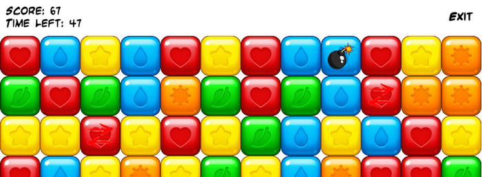

# Match3GameForest
Компьютерная игра в жанре Match-3. Разработана в Visual Studio 2019 на C# с использованием фреймворка MonoGame. Писалась как тестовое задание по ТЗ от GameForest.

## Фграмент игрового экрана

## Базовая механика
Игры этого жанра характеризуются тем, что их игровой мир состоит из таблицы или сетки элементов, а задачей игрока является манипулирование элементами таким образом, чтобы совпали заданные игрой шаблонные комбинации, и после выполнения условия собранные элементы исчезают.

## Экранные формы
Реализовано 3 формы:
- Главное Меню — содержит настройки игры и кнопку запуска.
- Игровой Экран — непосредственно игровое поле.
- Конец Игры — отображает результат игровой сессии.

## Типы элементов
Элементы разделены на Обычные и Бонусы. В игре 5 Обычных элементов и 2 Бонуса: Line и Bomb.

### Обычные
Если на поле где-то стоят 3 или более элементов в ряд, элементы исчезают. На свободные места опускаются элементы, котороые находятся выше. Если выше элементов нет, то элементы просто появляются.

### Бонусы
Бонусы появляются при выполнении игровых условий:
- Комбинация из четырёх элементов в ряд приводит к образованию бонуса Line.
- Комбинация из 5 или более элементов в ряд приводит к образованию бонуса Bomb.
- Пересечение горизонтальной и вертикальной комбинаций из трёх и более элементов каждая приводит к образованию бонуса Bomb на пересечении.

#### Line
Line бонус участвует в матче, он срабатывает: элемент разрушается, и из
него в противоположных направлениях, зависящих от направления бонуса, вылетают два Разрушителя, каждый из которых летит прямо, пока не долетит до края игрового поля. Если над элементом летит Разрушитель, элемент уничтожается.

#### Bomb
В случае, если бонус Bomb участвует в матче, он срабатывает: элемент разрушается, и через 250 мс разрушаются все элементы вокруг него в квадрате 3х3 с центром в том месте, где взорвался бонус.